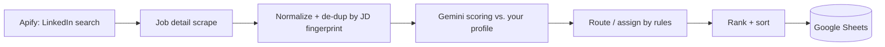

# Job Priority — AI-powered LinkedIn job tracker & scorer in Google Sheets

 · Google Apps Script

Turn a firehose of LinkedIn postings into a **ranked, de-duplicated shortlist** — scored by AI against
*your own* résumé, right inside a Google Sheet.

It scrapes LinkedIn jobs (via [Apify](https://apify.com)), scores each one against your profile with
**Google Gemini**, and maintains a prioritized queue (**P01 → P10**) with delegation, automatic
de-duplication, re-post handling, pruning, and cost controls — all driven from a **Jobs Pipeline** menu
in the sheet. No servers; it runs entirely on Google Apps Script.

> ⚠️ Personal-use tool. Scraping LinkedIn may conflict with LinkedIn's Terms of Service — use responsibly,
> at low volume, for your own job search. No warranty. See [Notes & limitations](#notes--limitations).

<!-- TODO: add a screenshot/GIF of the Job_Priority sheet and the Prompt sheet here -->

---

## What it does

- **Scrapes LinkedIn** for jobs matching your search (keywords, location, recency) on a schedule.
- **Scores every job with AI** against *your* résumé/profile — not generic keyword matching. Each job gets a
  priority **P01 (bullseye) → P10 (skip)**, a 0–100 score, a visa-sponsorship read, and a one-line
  "why the hiring manager would/wouldn't bite."
- **Prioritized queue** in the `Job_Priority` sheet, sorted so the best-fit, freshest roles float to the top.
- **Delegation** — auto-route mid-tier jobs to an "assignee" (e.g. a helper who fills out applications) via an
  `Assigned` sheet, while reserving top-tier jobs for your own review.
- **De-duplication & re-posts** — the same role posted under multiple job IDs is merged; a genuinely re-posted
  role that had expired automatically re-opens.
- **Cost controls** — cheap-but-capable model by default, capped "thinking", context caching, and skipping
  re-scores of jobs it has already seen.
- **Runs itself** — a scheduled trigger runs the pipeline every few hours, with quiet hours, and survives
  Google's 6-minute execution limit by saving progress and resuming.

---

## How it works



**Pipeline:** search → fetch job details → normalize & de-duplicate (by a hash of the job description, so the
same role under a new job ID is merged, not re-scored) → **Gemini scores** each new job against your profile →
**routing rules** set ownership (reserve / assign / skip) → **rank & sort** → write to the sheets.

**Built for Apps Script limits.** A run that can't finish in Google's 6-minute window **saves its state and
schedules itself to resume** — scraping, scoring, de-dup, and sort each run as resumable phases. Large
backlogs (thousands of rows) complete across multiple executions automatically.

**Efficient scoring.** The scoring prompt (your profile + the rubric) is sent once as a cached prefix; each job
adds only its own text. A per-job fingerprint means editing your prompt re-scores **new** jobs automatically,
and a re-posted role that's already scored is **not** paid for again.

### The sheets

| Sheet | What it's for |
|---|---|
| **Job_Priority** | The main ranked queue — every job, its score/priority/visa read, status, and owner. |
| **Assigned** | The assignee's work queue — a mirror of jobs delegated to them. |
| **Prompt** | Where you edit **your profile** and the **scoring instructions** (see [Customizing scoring](#customizing-the-scoring)). |
| **Settings** | All configuration (keys, model, schedule, routing rules). |
| **Apify_Accounts** | Your Apify API token(s) — supports rotating multiple accounts. |
| **Raw_Data** | Raw scraped payloads (kept only for jobs still in the queue). |
| **Help** | In-sheet reference for statuses, owners, visa signals, and settings. |

---

## Getting started (step by step)

You need two free accounts — **Apify** (to scrape jobs) and an **AI provider** (to score them) — then you
paste their keys into the sheet. Follow the steps in order; it takes ~15 minutes.

### Step 1 — Copy the sheet

**Make a copy** of the template Google Sheet: <!-- TODO: paste the "Make a copy" link here --> — the Apps
Script code is already attached. Everything below happens in your copy.

*(Developers who'd rather deploy the code themselves: see [Deploy with clasp](#deploy-with-clasp-developers) at the end.)*

### Step 2 — Create a free Apify account & copy your API token

1. Go to **[apify.com](https://apify.com)** → **Sign up** (free). Confirm your email and sign in. The free plan
   includes a small monthly usage credit — enough for a modest daily job search.
2. Click your avatar (top-right) → **Settings** → **API & Integrations**.
3. Copy your **Personal API token** (a long string). Keep it for Step 4.
   - The same token works for both fields you'll fill later. *(Power users: create additional Apify accounts and
     add them as extra rows to rotate/​increase capacity.)*
4. The tool runs two community actors — `cheap_scraper/linkedin-job-scraper` (search) and
   `apimaestro/linkedin-job-detail` (job details). Check their Apify Store pages for any per-result pricing.

### Step 3 — Get an AI key (pick one)

**Option A — Vertex AI free trial · recommended for regular use (~$300 free credit, no key to paste)**

1. Go to **[console.cloud.google.com](https://console.cloud.google.com)** and sign in with the **same Google
   account that owns your copied sheet**.
2. Start the **free trial** — you add a card, but new accounts get **~$300 in credit for 90 days** and are **not**
   auto-charged when it ends.
3. Create (or select) a **project**, and copy its **Project ID** (e.g. `my-jobs-123456`).
4. Enable the **Vertex AI API**: search "Vertex AI API" in the console → **Enable**.
5. That's it — no key to copy. The sheet reaches Vertex using your Google login. You'll put the Project ID in
   Settings in Step 5.

**Option B — Gemini API key · quickest to test (free quota)**

1. Go to **[aistudio.google.com/apikey](https://aistudio.google.com/apikey)** → sign in → **Create API key** → copy it.
2. Paste it into the **Settings** sheet, `GEMINI_API_KEY` cell (Step 5), and leave `GEMINI_API_ROUTE` = `developer`.
   - Anyone who can edit your sheet can read the key. For tighter privacy, leave the cell blank and set it in
     **Extensions → Apps Script → ⚙ Project Settings → Script Properties** (name `GEMINI_API_KEY`) instead.
3. Note: the free quota is rate-limited; if you hit "resource exhausted" errors during real use, switch to
   **Option A (Vertex)**.

### Step 4 — Add your Apify token to the sheet

On the **Apify_Accounts** sheet, fill one row:

| label | batch_key | detail_key | active |
|---|---|---|---|
| my-apify | *(your Apify token)* | *(your Apify token)* | `TRUE` |

### Step 5 — Configure Settings

On the **Settings** sheet, set (the rest have sensible defaults — see [Configuration](#configuration)):

- **`APIFY_RUN_INPUT`** — your LinkedIn search as JSON (keywords, location, filters). The **Help** sheet has a
  ready-to-edit example.
- **AI route:**
  - Chose **Option A (Vertex)** → set `GEMINI_API_ROUTE` = `vertex` and `VERTEX_PROJECT_ID` = your Project ID.
  - Chose **Option B (Gemini key)** → leave `GEMINI_API_ROUTE` = `developer` and paste your key into the `GEMINI_API_KEY` cell (or Script Properties for tighter privacy).
- **`NOTIFY_EMAIL`** — your email (for P01 alerts + failure notices).

### Step 6 — Add your profile

On the **Prompt** sheet, paste **your** résumé/profile into the profile cell (it ships with an *example* profile —
replace it). Scoring is only as good as this profile. See [Customizing the scoring](#customizing-the-scoring).

### Step 7 — Initialize & run

1. **Jobs Pipeline → Maintenance → Initialize Sheets** — approve the one-time Google authorization.
   - If several Google accounts are signed into your browser and it keeps asking for permission, open the sheet in
     a browser profile with **one** Google account. See [Notes](#notes--limitations).
2. **Jobs Pipeline → Run Now** — the first batch scrapes + scores. Watch the status cells at the top of
   **Job_Priority**.
3. Optional: **Jobs Pipeline → Triggers → Create Run Trigger** to run automatically on the schedule in Settings.

### Deploy with clasp (developers)

Prefer to run the code from this repo instead of the template?

```bash
npm install -g @google/clasp
clasp login
# In a NEW empty Google Sheet: Extensions → Apps Script → note its Script ID,
# then set that ID in .clasp.json (do not reuse the repo's scriptId).
clasp push
```

Then reload the sheet and follow **Steps 2–7** above.

---

## Configuration

All configuration lives on the **Settings** sheet (`setting_key` / `setting_value`). Key ones:

### Scraping
| Setting | Default | Purpose |
|---|---|---|
| `APIFY_RUN_INPUT` | *(blank)* | JSON search input (keywords, location, filters) for the search actor. See the Help sheet for an example. |
| `APIFY_LOOKBACK_HOURS` | *(blank)* | Fixed lookback window; blank = auto-compute from time since the last run. |
| `APIFY_MAX_LOOKBACK_HOURS` | `168` | Cap on the auto lookback (7 days) so an idle gap doesn't pull a huge batch. |

### AI scoring
| Setting | Default | Purpose |
|---|---|---|
| `GEMINI_API_ROUTE` | `developer` | `developer` (free-quota Gemini key) or `vertex` (your GCP project). |
| `VERTEX_PROJECT_ID` / `VERTEX_LOCATION` | / `global` | Required only for the Vertex route. |
| `SCORING_MODEL` | `gemini-3.5-flash` | Scoring model. See [Cost & performance](#cost--performance). |
| `SCORING_THINKING_LEVEL` | `low` | Gemini 3.x thinking budget: `minimal`/`low`/`medium`/`high`. `low` keeps reasoning while cutting cost + latency. |
| `SCORING_PARALLEL_REQUESTS` | `3` | Jobs scored in parallel per batch. |
| `SCORING_RPM_LIMIT` | `0` | Requests/min cap (set to your quota; `0` = no pacing). |

### Schedule
| Setting | Default | Purpose |
|---|---|---|
| `RUN_INTERVAL_HOURS` | `4` | Auto-run cadence (1–12h). Re-run **Create Run Trigger** after changing. |
| `QUIET_START_HOUR` / `QUIET_END_HOUR` | `19` / `5` | Quiet hours (Pacific Time); both `0` disables. |

### Routing & delegation
| Setting | Default | Purpose |
|---|---|---|
| `AUTO_RESERVE_PRIORITIES` | `P01,P02` | Never delegated — left unowned for your review. |
| `AUTO_ASSIGN_PRIORITIES` | `P03,P04,P05` | Auto-routed to the assignee (if they clear the visa + score filters). |
| `AUTO_ASSIGN_MIN_SCORE` | *(blank)* | Minimum score for assignee routing. |
| `AUTO_ASSIGN_VISA` | `Yes…,Unclear (50%)` | Visa signals eligible for delegation. |
| `AUTO_SKIP_VISA_NO` | `TRUE` | Jobs scored "No (0%)" (no sponsorship) → auto-`Skip (auto)`. |
| `RESERVED_COMPANIES` / `AUTO_ASSIGN_EXCLUDE_COMPANIES` | *(blank)* | Keep-for-yourself / skip-entirely company lists. |

### Notifications
| Setting | Purpose |
|---|---|
| `NOTIFY_EMAIL` | Your email — P01 alerts + critical-failure notices. |
| `NOTIFY_ASSIGNEE_EMAIL` | Assignee's email — notified when new jobs are routed to them. |

> The full list, with notes, is on the **Settings** sheet itself.

---

## Using it

Everything is driven from the **Jobs Pipeline** menu:

- **Run Now** — scrape + score + rank immediately.
- **Import Jobs Manually…** — paste LinkedIn job URLs to score specific roles.
- **Assign Selected Rows** / **Reassign by Rules** — delegate manually, or re-apply the routing rules.
- **Reevaluate Selected Rows** — force a re-score of selected rows (e.g. after editing your prompt).
- **Sort & Rank Sheets** — re-rank and re-mirror both sheets.
- **Open Prompt & Profile** — jump to the Prompt sheet.
- **Triggers** — create/remove the scheduled auto-run.
- **Maintenance** — Prune Old Data, Skip All No-Visa Jobs, Initialize Sheets, Validate Config.

**Priorities:** `P01` (rare bullseye) → `P04` (solid, default) → `P10` (skip). Most jobs land P03–P05.

**Statuses:** `New` → `Filled` → `Submitted` (workflow); `Networking`; `Flagged` (needs your attention);
`Skip` (you rejected it — sticky) vs `Skip (auto)` (rules skipped it — re-evaluable); `Closed` (posting expired
— re-opens automatically if the role is re-posted).

**Owner / lanes:** blank = unmanaged (rules may act on it) · `Me` = your manual claim (rules never touch) ·
`Assignee` = manually delegated (locked) · `Assignee (auto)` = delegated by the rules (re-evaluable).

---

## Customizing the scoring

Open the **Prompt** sheet (or **Jobs Pipeline → Open Prompt & Profile**) and edit column B directly — no menu,
no permission prompt:

- **Your profile** — paste your résumé/skills. This is what jobs are scored against.
- **Scoring instructions** — the rubric. Leave it **blank** to use the built-in default (which improves over
  time); a read-only reference cell shows the current default to copy from if you want to customize.

Clear a cell to fall back to the built-in default. Edits affect **new** jobs on the next run; use **Reevaluate
Selected Rows** to re-score existing rows.

> The built-in profile/rubric ships as an **example** (an AI/ML identity-&-fraud product manager). **Replace the
> profile with your own** — the scoring is only as good as the profile it compares against. The rubric encodes a
> "hiring-manager" simulation, domain-expertise tiers, and a scarce-asset match model; you can tune it, but the
> default is a sensible starting point.

---

## Cost & performance

- **Model:** `gemini-3.5-flash` (default) balances quality and price for scoring. `gemini-3.1-flash-lite` is
  ~6× cheaper for high volume but isn't a reasoning model — test quality first. Avoid Pro tiers for scoring.
- **Thinking:** `SCORING_THINKING_LEVEL=low` cuts the dominant cost (thinking tokens) and latency.
- **Caching + de-dup:** the profile/rubric is cached across a run; re-posted roles you've already scored are
  skipped, so a daily run typically scores only the genuinely new jobs.
- **Cadence:** fewer runs = lower cost. For a job search, 1–2×/day (`RUN_INTERVAL_HOURS` ≥ 12) is plenty.
- **Editing the prompt** re-scores new jobs for free (on the next run); a full **Reevaluate** of the backlog is
  a paid re-score — test prompt changes on a small sample, not the whole sheet.

---

## Notes & limitations

- **Apps Script 6-minute limit** — handled via save-and-resume; very large backlogs finish across multiple runs.
- **Multiple Google accounts** — the in-sheet menu dialogs can hit a repeating authorization prompt when several
  Google accounts are signed into the same browser. Use a single-account browser profile, or edit prompts
  directly on the Prompt sheet (which needs no authorization).
- **LinkedIn Terms of Service** — scraping may conflict with LinkedIn's ToS. This is a personal-use tool; keep
  volume low and use at your own risk.
- **No warranty** — provided as-is.

---

## License

No license is set yet. <!-- TODO: choose one — e.g. MIT for open use, or a personal-use notice. -->
Until a license is added, all rights are reserved by the author.

---

*Original design notes: [`docs/superpowers/specs`](docs/superpowers/specs) and
[`docs/superpowers/plans`](docs/superpowers/plans) (historical; the implementation has evolved since).*
